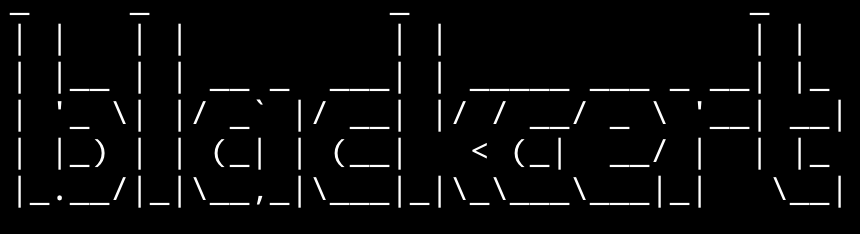
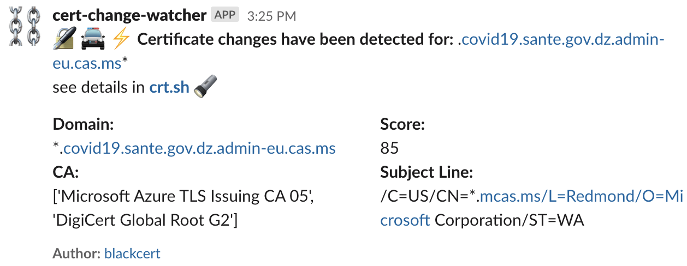

# blackcert 📓
Blackcert monitors [Certificate Transparency Logs](https://en.wikipedia.org/wiki/Certificate_Transparency) for a keyword. Blackcert collects any certificate changes for this keyword and also checks if any domain changes with that keyword look like a phishing domain. 

# Purpose
Developed to proactively monitor for actors registering certificates for a domain for phishing purposes. Although I have found it useful/used for:

* monitoring certificate changes for your company, for example, configure keyword `splunk`
* monitoring/enumerating customers for companies that use SAN, for example seeing all customers registered by fastly or medium, since they add a new domain alias to their shared certificate for new customers. configure `medium, fastly`
* monitoring for fraud sites that relate to topical things, for example, all domains that have registered for a certificate with the words configure `coronavirus, covid, chloroquine`. 

# Installation

1. clone project: `git clone https://github.com/d1vious/blackcert.git && cd blackcert`
2. install depencecies in virtualenvironment: `pip install virtualenv && virtualenv -p python3 venv && source venv/bin/activate && pip install -r requirements.txt`
3. configure keywords to monitor and slack webhook optionally by editing [blackcert.conf](https://github.com/d1vious/blackcert/blob/master/blackcert.conf)

# Run

`python blackert.py`

all results will be printed and also written to [results.log](#results-log) by default.

# Usage

```
usage: blackcert.py [-h] [-c CONFIG] [-o OUTPUT] [-v]

starts listening for newly registered certificates and sends slack alerts when
it matches

optional arguments:
  -h, --help            show this help message and exit
  -c CONFIG, --config CONFIG
                        path to the configuration file of blackcert
  -o OUTPUT, --output OUTPUT
                        path to a JSON log file of the matches
  -v, --version         shows current blackcert version
```

# Slack Alerts
I recommend creating a bot channel eg. blackcert-bot and then creating a webhook for it. Below is an example message for it. Protip inviting the SOC into a bot channel like this will help them understand how certificates are being used in the org. 😉


  
# Phishing Score Calculation
  The score calculation is graciously borrowed from [Phishing Catcher](phishing_catcher) which was an inspiration for this project. It calculates the score using the following workflow: 
  
1. adds 20 points if it has a [suspicios TLPs](https://github.com/d1vious/blackcert/blob/master/suspicious.yaml#L137)
2. Add points for [higher entropy](https://github.com/d1vious/blackcert/blob/master/blackcert.py#L79)
3. Adds 10 points for [fake](https://github.com/d1vious/blackcert/blob/master/blackcert.py#L87) .com .net .org, for example `*.com-account-management.info`
4. Add points for [suspecios keywords](https://github.com/d1vious/blackcert/blob/master/suspicious.yaml#L1).
5. Adds points for [too many](https://github.com/d1vious/blackcert/blob/master/blackcert.py#L102) `-` character in the domain, for example, `www.paypal-datacenter.com-acccount-alert.com`
6. Adds points for [deeply nested](https://github.com/d1vious/blackcert/blob/master/blackcert.py#L106) domains, for example, `www.paypal.com.security.accountupdate.gq`

# Results.json
Below is an example of how objects are saved in results.json. Protip, indexing these in a system like Splunk or ES will allow you to create a nice histogram on certificate changes for your organization, a competitor, or even mine the data for enumeration purposes. 

```
{
  "timestamp": "2020-03-26T03:26:58.097680",
  "fingerprint": "51635745d6b7da0914196e6015023bac67351e86",
  "domain": "woodsnap.com",
  "subject": "/C=US/CN=sni.cloudflaressl.com/L=San Francisco/O=Cloudflare, Inc./ST=CA",
  "CA": [
    "CloudFlare Inc ECC CA-2",
    "Baltimore CyberTrust Root"
  ],
  "score": 29
}
```
